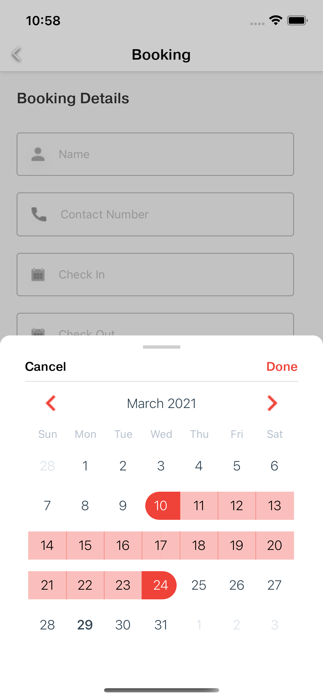

# React Native [Web] + Monorepo
Focus mainly on building UI for a Hotel Booking app

## 100% code sharing between Web, iOS

Tech Stack: TypeScript v4, React Native v0.63 & Create React App v4.

### How to run

- Web
  - [CRA] `$ yarn workspace web-cra start`
- Mobile
  - [iOS]
    - `$ cd packages/mobile/ios && pod update && sudo gem install cocoapods`
    - [CLI]
      - `$ yarn workspace mobile start`
    - [Xcode]
      - Press the Run button

<img src="./screenshots/" height="100" /
